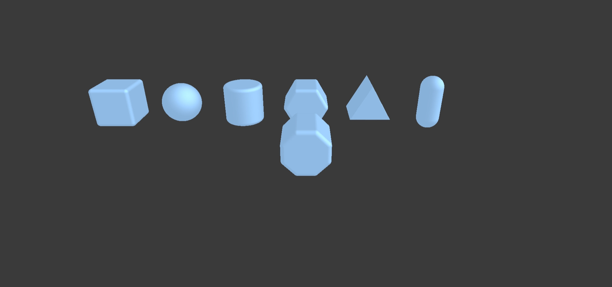
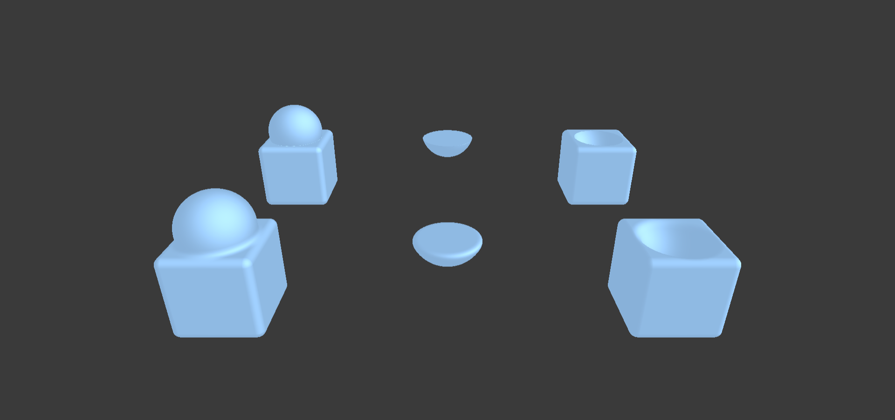

<h1 align="center">Welcome to marcher.js 👋</h1>
<p>
  <a href="https://www.npmjs.com/package/marcher.js" target="_blank">
    
  </a>
  <a href="#" target="_blank">
    
  </a>
  <a href="https://twitter.com/alphardex007" target="_blank">
    
  </a>
</p>

> A raymarching shader generator.

## Install

```sh
npm i marcher.js
```

## Usage

```ts
import * as marcher from "marcher.js";

// create Marcher object
const mar = new marcher.Marcher({
  antialias: false,
});

// create SDF material
const mat = new marcher.SDFMaterial();
// add a black color material
mat.addColorMaterial("1.0", 0, 0, 0);
// use SDF material
mar.setMaterial(mat);

// create SDF map function
const map = new marcher.SDFMapFunction();

// code block
{
  // create a layer
  const layer = new marcher.SDFLayer();

  // create a box SDF
  const box = new marcher.BoxSDF({
    sdfVarName: "d1",
  });
  // add box SDF to the layer
  layer.addPrimitive(box);
  // make round corners for box SDF
  box.round(0.1);

  // add layer to the map function
  map.addLayer(layer);
}

// use the map function
mar.setMapFunction(map);

// then you get the whole raymarching fragment shader
// just paste it into the shadertoy and see the magic
// https://www.shadertoy.com/new
console.log(mar.fragmentShader);
```

## Previews

### Basic Scene


### Primitives



### Boolean



### Pokeball


## Author

👤 **alphardex**

- Website: https://alphardex.netlify.app
- Twitter: [@alphardex007](https://twitter.com/alphardex007)
- Github: [@alphardex](https://github.com/alphardex)

## Show your support

Give a ⭐️ if this project helped you!

---

_This README was generated with ❤️ by [readme-md-generator](https://github.com/kefranabg/readme-md-generator)_
